# WORKFLOW

End-to-end workflows of the Alfiz Ilham portfolio, drawn as Mermaid diagrams. GitHub, VS Code (with a Mermaid extension), and most Markdown viewers render them. Exact rules and limits are in `SPEC.md`.

Contents:

1. Setup and deploy
2. Visitor journey
3. Contact form submission
4. Admin sign in and session
5. Project management
6. Certificate management
7. Message inbox and reply
8. Testimonial intake through MCP
9. Testimonial moderation
10. API key lifecycle
11. Analytics data flow
12. Settings and password change
13. Public content visibility
14. Data model
15. Failure handling summary

## 1. Setup and deploy

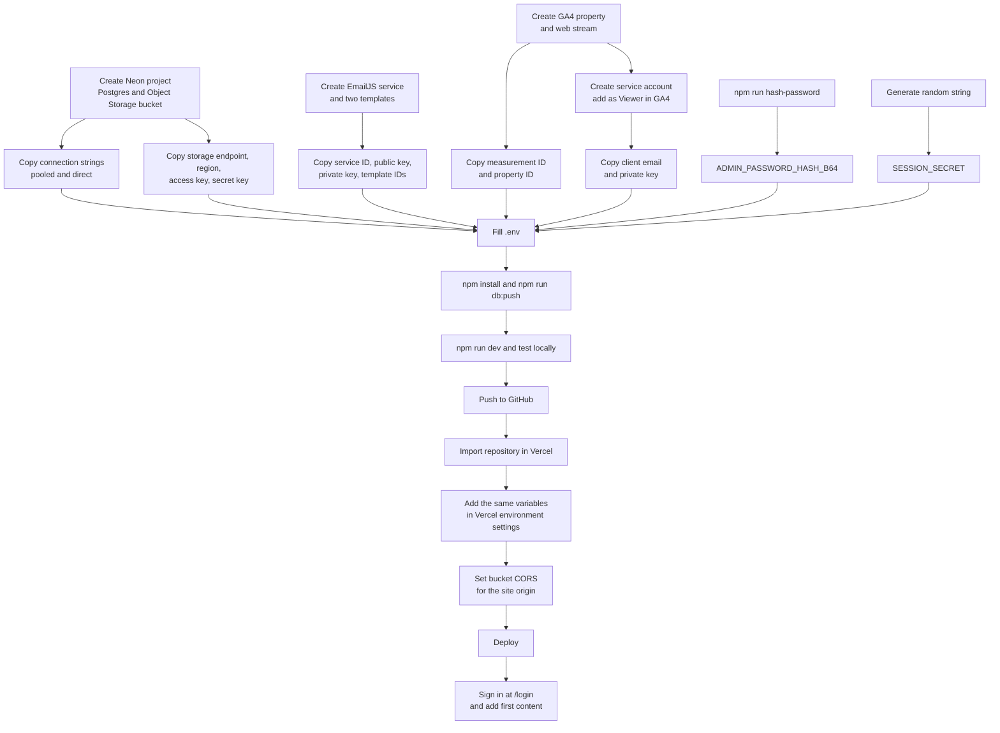
```mermaid
flowchart TD
    A["Create Neon project<br/>Postgres and Object Storage bucket"] --> B["Copy connection strings<br/>pooled and direct"]
    A --> C["Copy storage endpoint, region,<br/>access key, secret key"]
    D["Create EmailJS service<br/>and two templates"] --> E["Copy service ID, public key,<br/>private key, template IDs"]
    F["Create GA4 property<br/>and web stream"] --> G["Copy measurement ID<br/>and property ID"]
    F --> H["Create service account<br/>add as Viewer in GA4"]
    H --> I["Copy client email<br/>and private key"]
    J["npm run hash-password"] --> K["ADMIN_PASSWORD_HASH_B64"]
    L["Generate random string"] --> M["SESSION_SECRET"]

    B --> ENV["Fill .env"]
    C --> ENV
    E --> ENV
    G --> ENV
    I --> ENV
    K --> ENV
    M --> ENV

    ENV --> N["npm install and npm run db:push"]
    N --> O["npm run dev and test locally"]
    O --> P["Push to GitHub"]
    P --> Q["Import repository in Vercel"]
    Q --> R["Add the same variables<br/>in Vercel environment settings"]
    R --> S["Set bucket CORS<br/>for the site origin"]
    S --> T["Deploy"]
    T --> U["Sign in at /login<br/>and add first content"]
```

Build pipeline on every deploy:

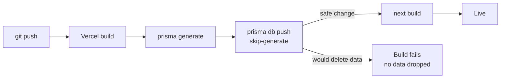
```mermaid
flowchart LR
    PUSH["git push"] --> VB["Vercel build"]
    VB --> GEN["prisma generate"]
    GEN --> DBP["prisma db push<br/>skip-generate"]
    DBP -->|"safe change"| NB["next build"]
    DBP -->|"would delete data"| STOP["Build fails<br/>no data dropped"]
    NB --> LIVE["Live"]
```

## 2. Visitor journey

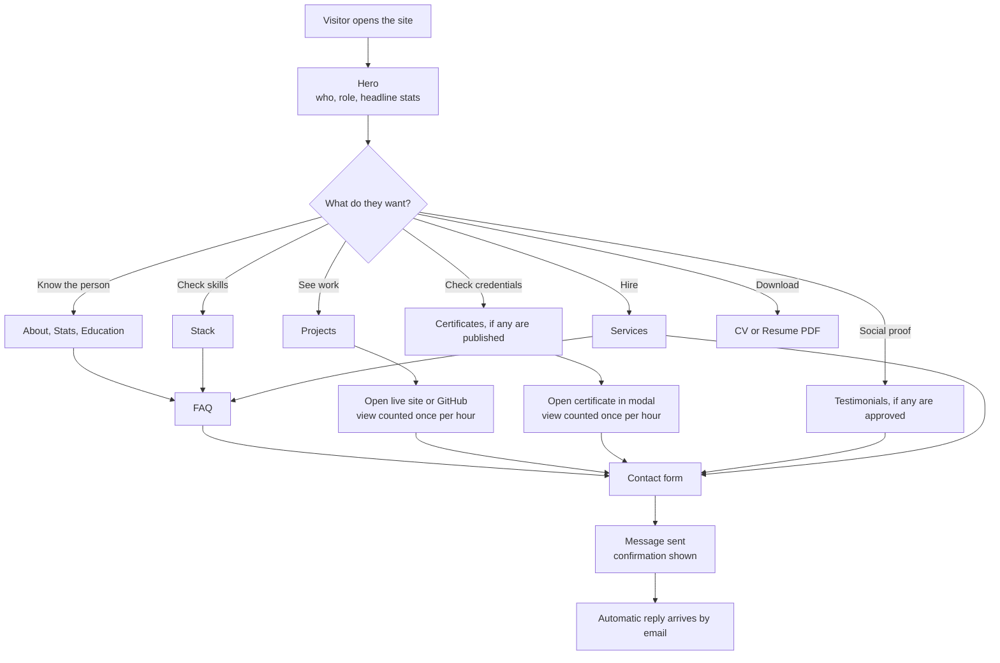
```mermaid
flowchart TD
    START["Visitor opens the site"] --> HERO["Hero<br/>who, role, headline stats"]
    HERO --> NAV{"What do they want?"}
    NAV -->|"Know the person"| ABOUT["About, Stats, Education"]
    NAV -->|"Check skills"| STACK["Stack"]
    NAV -->|"See work"| PROJ["Projects"]
    NAV -->|"Check credentials"| CERT["Certificates, if any are published"]
    NAV -->|"Social proof"| TEST["Testimonials, if any are approved"]
    NAV -->|"Hire"| SERV["Services"]
    NAV -->|"Download"| DL["CV or Resume PDF"]

    PROJ --> VIEWP["Open live site or GitHub<br/>view counted once per hour"]
    CERT --> VIEWC["Open certificate in modal<br/>view counted once per hour"]
    ABOUT --> FAQ["FAQ"]
    STACK --> FAQ
    SERV --> FAQ
    FAQ --> CONTACT["Contact form"]
    VIEWP --> CONTACT
    VIEWC --> CONTACT
    TEST --> CONTACT
    SERV --> CONTACT
    CONTACT --> SENT["Message sent<br/>confirmation shown"]
    SENT --> MAIL["Automatic reply arrives by email"]
```

## 3. Contact form submission

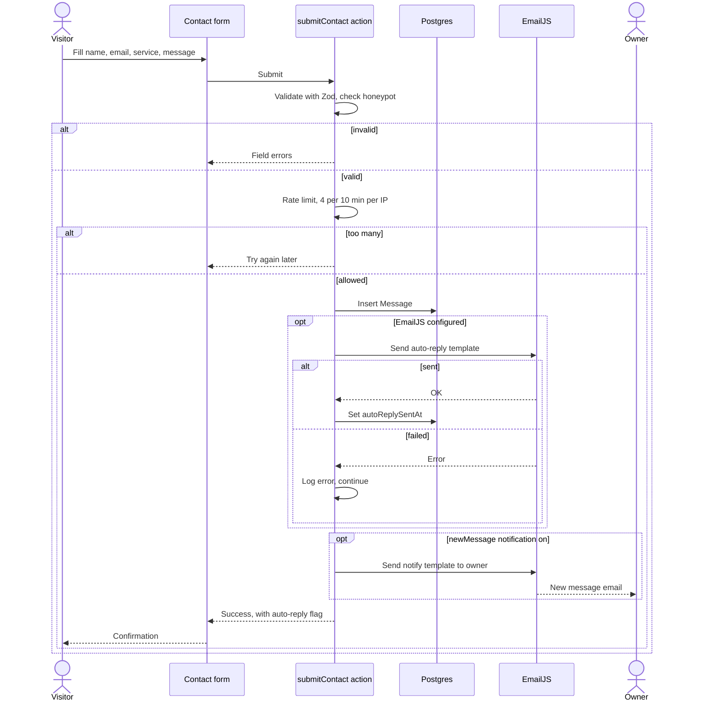
```mermaid
sequenceDiagram
    actor V as Visitor
    participant F as Contact form
    participant S as submitContact action
    participant D as Postgres
    participant E as EmailJS
    actor O as Owner

    V->>F: Fill name, email, service, message
    F->>S: Submit
    S->>S: Validate with Zod, check honeypot
    alt invalid
        S-->>F: Field errors
    else valid
        S->>S: Rate limit, 4 per 10 min per IP
        alt too many
            S-->>F: Try again later
        else allowed
            S->>D: Insert Message
            opt EmailJS configured
                S->>E: Send auto-reply template
                alt sent
                    E-->>S: OK
                    S->>D: Set autoReplySentAt
                else failed
                    E-->>S: Error
                    S->>S: Log error, continue
                end
            end
            opt newMessage notification on
                S->>E: Send notify template to owner
                E-->>O: New message email
            end
            S-->>F: Success, with auto-reply flag
            F-->>V: Confirmation
        end
    end
```

## 4. Admin sign in and session

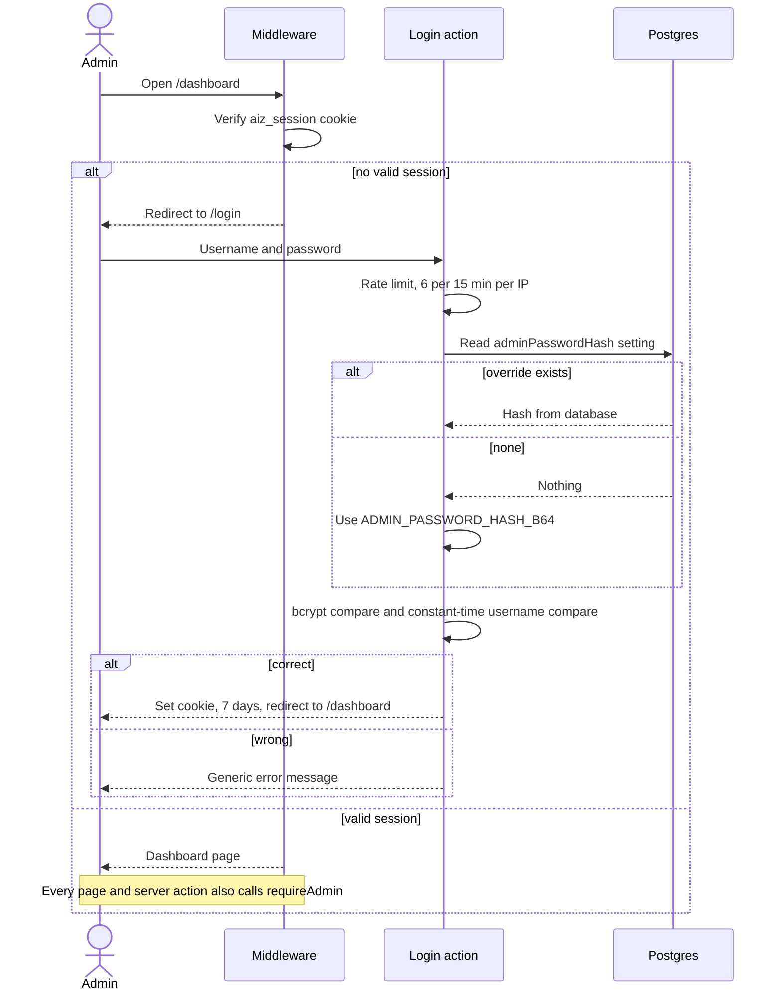
```mermaid
sequenceDiagram
    actor A as Admin
    participant M as Middleware
    participant L as Login action
    participant D as Postgres

    A->>M: Open /dashboard
    M->>M: Verify aiz_session cookie
    alt no valid session
        M-->>A: Redirect to /login
        A->>L: Username and password
        L->>L: Rate limit, 6 per 15 min per IP
        L->>D: Read adminPasswordHash setting
        alt override exists
            D-->>L: Hash from database
        else none
            D-->>L: Nothing
            L->>L: Use ADMIN_PASSWORD_HASH_B64
        end
        L->>L: bcrypt compare and constant-time username compare
        alt correct
            L-->>A: Set cookie, 7 days, redirect to /dashboard
        else wrong
            L-->>A: Generic error message
        end
    else valid session
        M-->>A: Dashboard page
        Note over A,M: Every page and server action also calls requireAdmin
    end
```

Logout deletes the cookie and redirects to `/login`.

## 5. Project management

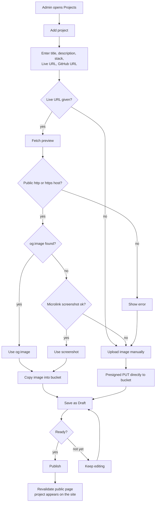
```mermaid
flowchart TD
    A["Admin opens Projects"] --> B["Add project"]
    B --> C["Enter title, description, stack,<br/>Live URL, GitHub URL"]
    C --> D{"Live URL given?"}
    D -->|"yes"| E["Fetch preview"]
    D -->|"no"| M["Upload image manually"]
    E --> F{"Public http or https host?"}
    F -->|"no"| ERR["Show error"]
    F -->|"yes"| G{"og:image found?"}
    G -->|"yes"| H["Use og:image"]
    G -->|"no"| I{"Microlink screenshot ok?"}
    I -->|"yes"| J["Use screenshot"]
    I -->|"no"| M
    ERR --> M
    H --> K["Copy image into bucket"]
    J --> K
    M --> N["Presigned PUT directly to bucket"]
    K --> O["Save as Draft"]
    N --> O
    O --> P{"Ready?"}
    P -->|"yes"| Q["Publish"]
    P -->|"not yet"| R["Keep editing"]
    R --> O
    Q --> S["Revalidate public page<br/>project appears on the site"]
```

Upload detail:

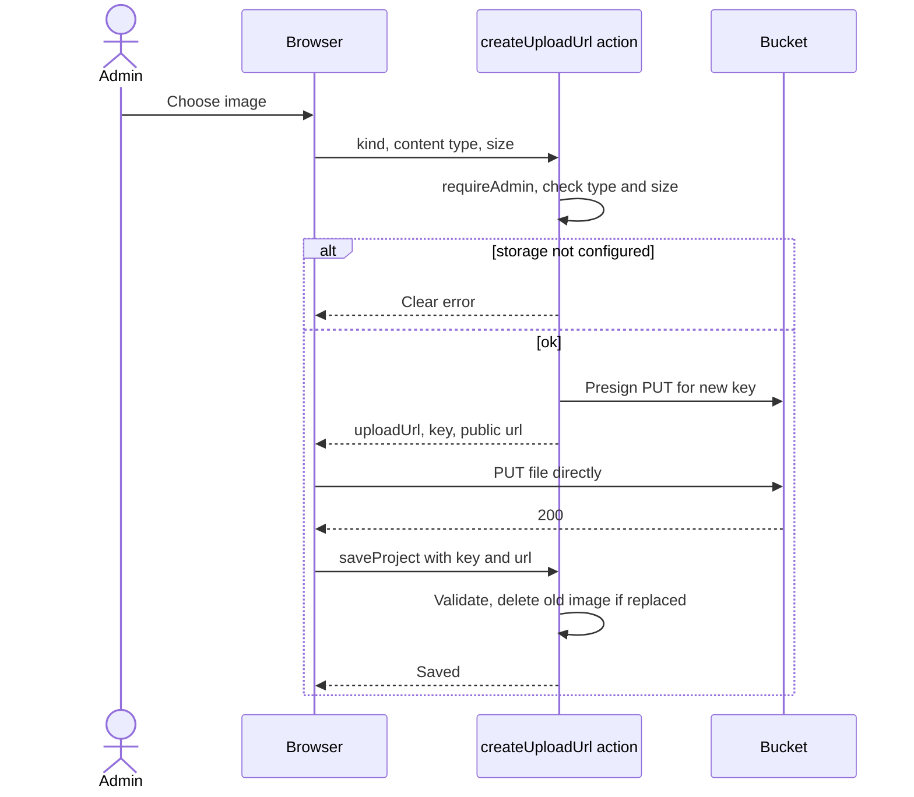
```mermaid
sequenceDiagram
    actor A as Admin
    participant UI as Browser
    participant S as createUploadUrl action
    participant B as Bucket

    A->>UI: Choose image
    UI->>S: kind, content type, size
    S->>S: requireAdmin, check type and size
    alt storage not configured
        S-->>UI: Clear error
    else ok
        S->>B: Presign PUT for new key
        S-->>UI: uploadUrl, key, public url
        UI->>B: PUT file directly
        B-->>UI: 200
        UI->>S: saveProject with key and url
        S->>S: Validate, delete old image if replaced
        S-->>UI: Saved
    end
```

Project status:

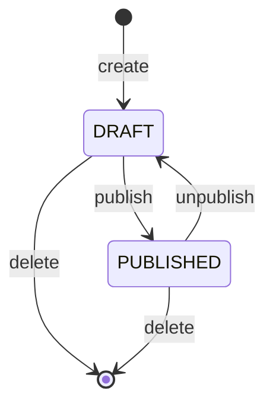
```mermaid
stateDiagram-v2
    [*] --> DRAFT: create
    DRAFT --> PUBLISHED: publish
    PUBLISHED --> DRAFT: unpublish
    DRAFT --> [*]: delete
    PUBLISHED --> [*]: delete
```

## 6. Certificate management

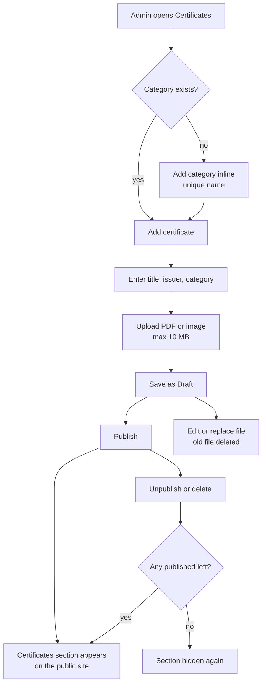
```mermaid
flowchart TD
    A["Admin opens Certificates"] --> B{"Category exists?"}
    B -->|"no"| C["Add category inline<br/>unique name"]
    B -->|"yes"| D["Add certificate"]
    C --> D
    D --> E["Enter title, issuer, category"]
    E --> F["Upload PDF or image<br/>max 10 MB"]
    F --> G["Save as Draft"]
    G --> H["Publish"]
    H --> I["Certificates section appears<br/>on the public site"]
    G --> J["Edit or replace file<br/>old file deleted"]
    H --> K["Unpublish or delete"]
    K --> L{"Any published left?"}
    L -->|"no"| M["Section hidden again"]
    L -->|"yes"| I
```

A category that still has certificates cannot be deleted.

## 7. Message inbox and reply

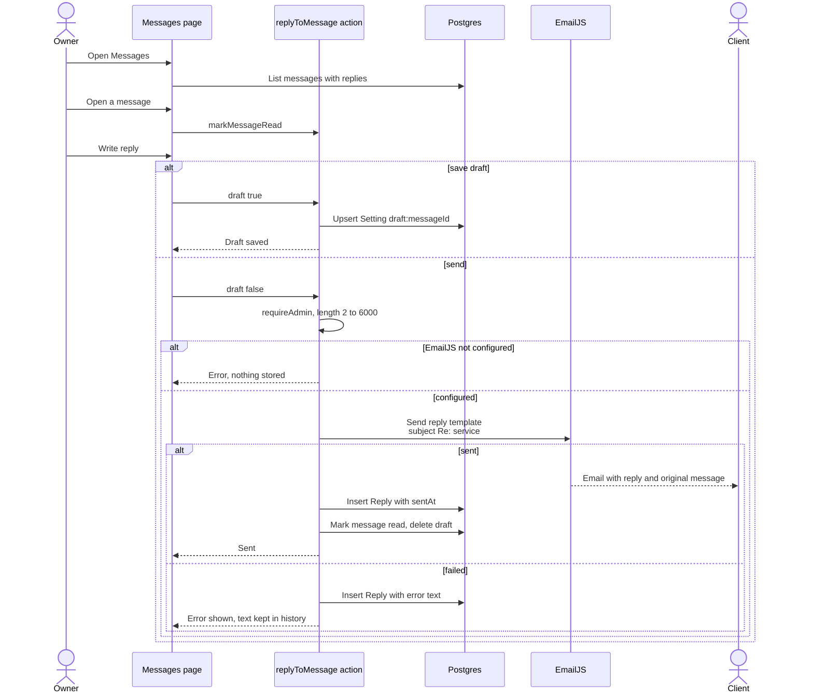
```mermaid
sequenceDiagram
    actor O as Owner
    participant UI as Messages page
    participant S as replyToMessage action
    participant D as Postgres
    participant E as EmailJS
    actor C as Client

    O->>UI: Open Messages
    UI->>D: List messages with replies
    O->>UI: Open a message
    UI->>S: markMessageRead
    O->>UI: Write reply
    alt save draft
        UI->>S: draft true
        S->>D: Upsert Setting draft:messageId
        S-->>UI: Draft saved
    else send
        UI->>S: draft false
        S->>S: requireAdmin, length 2 to 6000
        alt EmailJS not configured
            S-->>UI: Error, nothing stored
        else configured
            S->>E: Send reply template<br/>subject Re: service
            alt sent
                E-->>C: Email with reply and original message
                S->>D: Insert Reply with sentAt
                S->>D: Mark message read, delete draft
                S-->>UI: Sent
            else failed
                S->>D: Insert Reply with error text
                S-->>UI: Error shown, text kept in history
            end
        end
    end
```

Message and reply states:

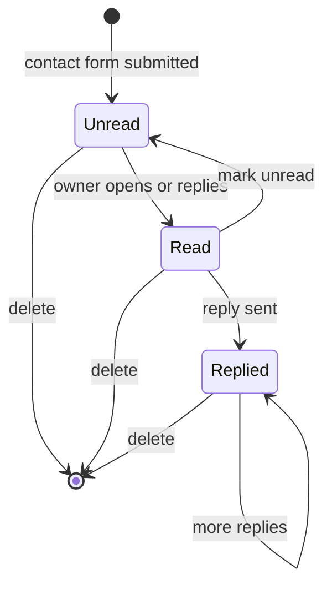
```mermaid
stateDiagram-v2
    [*] --> Unread: contact form submitted
    Unread --> Read: owner opens or replies
    Read --> Unread: mark unread
    Read --> Replied: reply sent
    Replied --> Replied: more replies
    Unread --> [*]: delete
    Read --> [*]: delete
    Replied --> [*]: delete
```

## 8. Testimonial intake through MCP

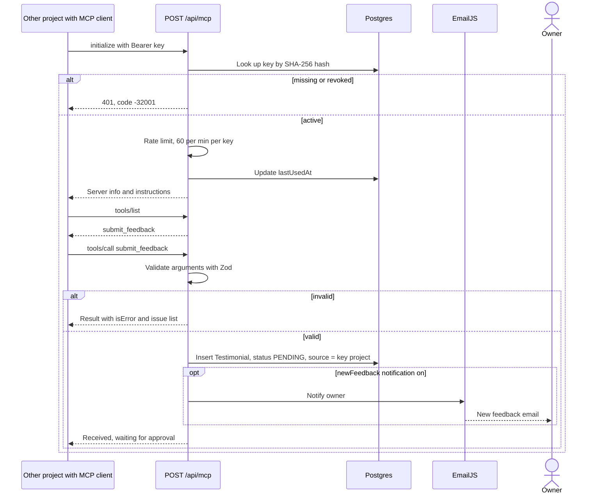
```mermaid
sequenceDiagram
    participant P as Other project with MCP client
    participant R as POST /api/mcp
    participant D as Postgres
    participant E as EmailJS
    actor O as Owner

    P->>R: initialize with Bearer key
    R->>D: Look up key by SHA-256 hash
    alt missing or revoked
        R-->>P: 401, code -32001
    else active
        R->>R: Rate limit, 60 per min per key
        R->>D: Update lastUsedAt
        R-->>P: Server info and instructions
        P->>R: tools/list
        R-->>P: submit_feedback
        P->>R: tools/call submit_feedback
        R->>R: Validate arguments with Zod
        alt invalid
            R-->>P: Result with isError and issue list
        else valid
            R->>D: Insert Testimonial, status PENDING, source = key project
            opt newFeedback notification on
                R->>E: Notify owner
                E-->>O: New feedback email
            end
            R-->>P: Received, waiting for approval
        end
    end
```

## 9. Testimonial moderation

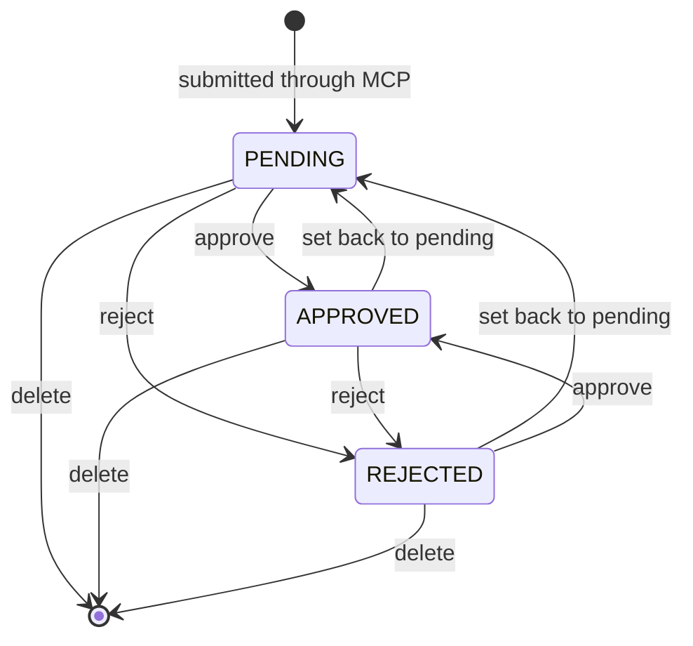
```mermaid
stateDiagram-v2
    [*] --> PENDING: submitted through MCP
    PENDING --> APPROVED: approve
    PENDING --> REJECTED: reject
    APPROVED --> PENDING: set back to pending
    REJECTED --> PENDING: set back to pending
    APPROVED --> REJECTED: reject
    REJECTED --> APPROVED: approve
    PENDING --> [*]: delete
    APPROVED --> [*]: delete
    REJECTED --> [*]: delete
```

Only `APPROVED` testimonials appear on the public site. The Testimonials section is hidden while none are approved.

## 10. API key lifecycle

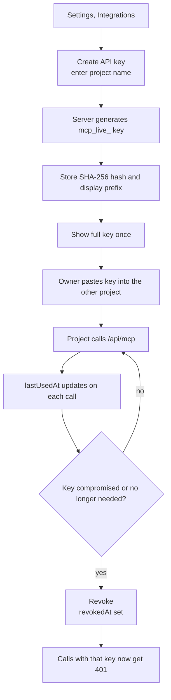
```mermaid
flowchart TD
    A["Settings, Integrations"] --> B["Create API key<br/>enter project name"]
    B --> C["Server generates mcp_live_ key"]
    C --> D["Store SHA-256 hash and display prefix"]
    D --> E["Show full key once"]
    E --> F["Owner pastes key into the other project"]
    F --> G["Project calls /api/mcp"]
    G --> H["lastUsedAt updates on each call"]
    H --> I{"Key compromised or no longer needed?"}
    I -->|"yes"| J["Revoke<br/>revokedAt set"]
    J --> K["Calls with that key now get 401"]
    I -->|"no"| G
```

## 11. Analytics data flow

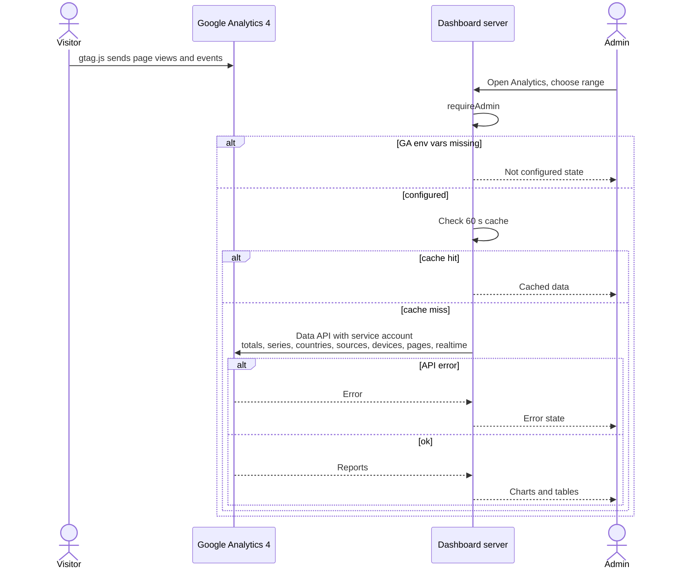
```mermaid
sequenceDiagram
    actor V as Visitor
    participant GA as Google Analytics 4
    participant S as Dashboard server
    actor A as Admin

    V->>GA: gtag.js sends page views and events
    A->>S: Open Analytics, choose range
    S->>S: requireAdmin
    alt GA env vars missing
        S-->>A: Not configured state
    else configured
        S->>S: Check 60 s cache
        alt cache hit
            S-->>A: Cached data
        else cache miss
            S->>GA: Data API with service account<br/>totals, series, countries, sources, devices, pages, realtime
            alt API error
                GA-->>S: Error
                S-->>A: Error state
            else ok
                GA-->>S: Reports
                S-->>A: Charts and tables
            end
        end
    end
```

## 12. Settings and password change

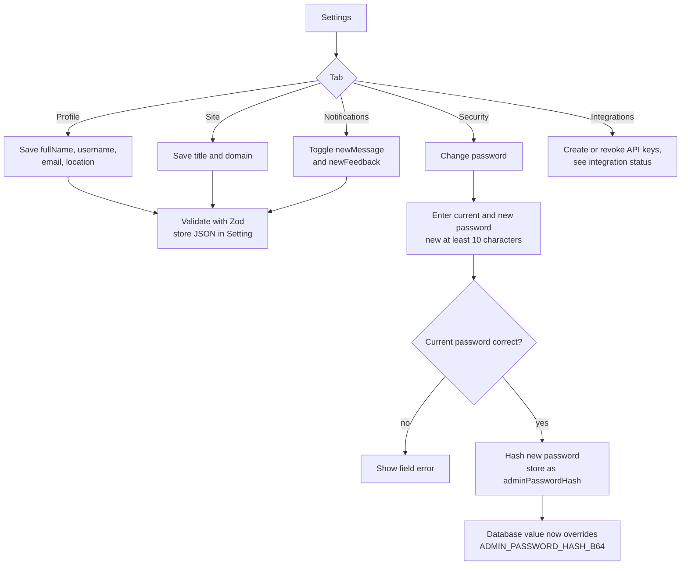
```mermaid
flowchart TD
    A["Settings"] --> B{"Tab"}
    B -->|"Profile"| C["Save fullName, username,<br/>email, location"]
    B -->|"Site"| D["Save title and domain"]
    B -->|"Notifications"| E["Toggle newMessage<br/>and newFeedback"]
    B -->|"Security"| F["Change password"]
    B -->|"Integrations"| G["Create or revoke API keys,<br/>see integration status"]
    C --> H["Validate with Zod<br/>store JSON in Setting"]
    D --> H
    E --> H
    F --> I["Enter current and new password<br/>new at least 10 characters"]
    I --> J{"Current password correct?"}
    J -->|"no"| K["Show field error"]
    J -->|"yes"| L["Hash new password<br/>store as adminPasswordHash"]
    L --> M["Database value now overrides<br/>ADMIN_PASSWORD_HASH_B64"]
```

## 13. Public content visibility

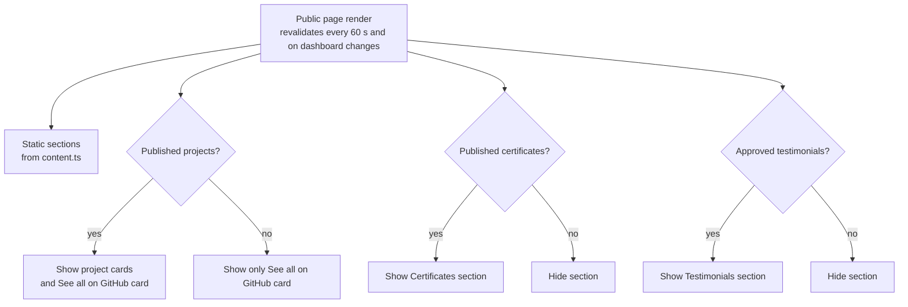
```mermaid
flowchart TD
    A["Public page render<br/>revalidates every 60 s and on dashboard changes"] --> B["Static sections<br/>from content.ts"]
    A --> C{"Published projects?"}
    C -->|"yes"| C1["Show project cards<br/>and See all on GitHub card"]
    C -->|"no"| C2["Show only See all on GitHub card"]
    A --> D{"Published certificates?"}
    D -->|"yes"| D1["Show Certificates section"]
    D -->|"no"| D2["Hide section"]
    A --> E{"Approved testimonials?"}
    E -->|"yes"| E1["Show Testimonials section"]
    E -->|"no"| E2["Hide section"]
```

## 14. Data model

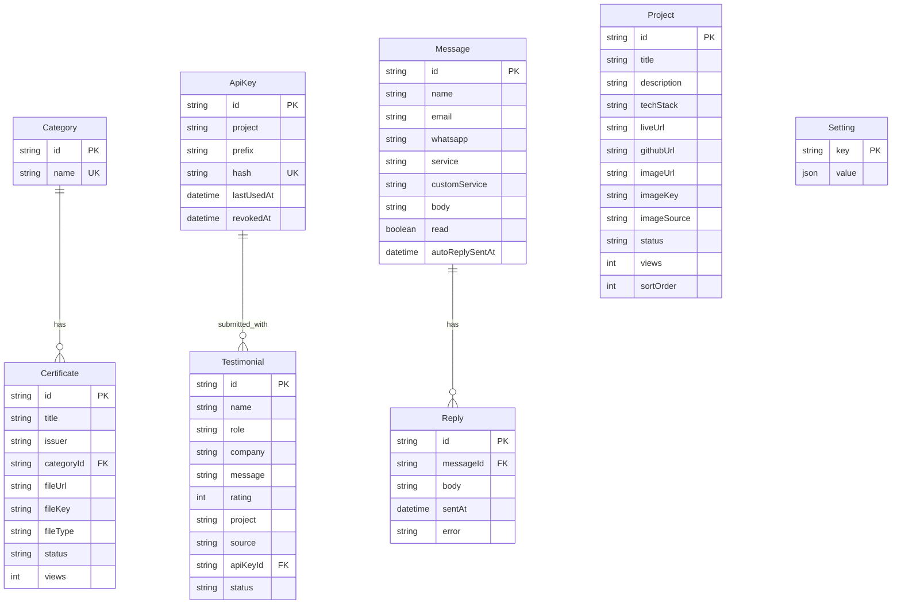
```mermaid
erDiagram
    Category ||--o{ Certificate : has
    ApiKey ||--o{ Testimonial : submitted_with
    Message ||--o{ Reply : has

    Project {
        string id PK
        string title
        string description
        string techStack
        string liveUrl
        string githubUrl
        string imageUrl
        string imageKey
        string imageSource
        string status
        int views
        int sortOrder
    }
    Category {
        string id PK
        string name UK
    }
    Certificate {
        string id PK
        string title
        string issuer
        string categoryId FK
        string fileUrl
        string fileKey
        string fileType
        string status
        int views
    }
    ApiKey {
        string id PK
        string project
        string prefix
        string hash UK
        datetime lastUsedAt
        datetime revokedAt
    }
    Testimonial {
        string id PK
        string name
        string role
        string company
        string message
        int rating
        string project
        string source
        string apiKeyId FK
        string status
    }
    Message {
        string id PK
        string name
        string email
        string whatsapp
        string service
        string customService
        string body
        boolean read
        datetime autoReplySentAt
    }
    Reply {
        string id PK
        string messageId FK
        string body
        datetime sentAt
        string error
    }
    Setting {
        string key PK
        json value
    }
```

`Setting` holds the `profile`, `site`, and `notifications` JSON, the `adminPasswordHash` override, and reply drafts under `draft:<messageId>`.

## 15. Failure handling summary

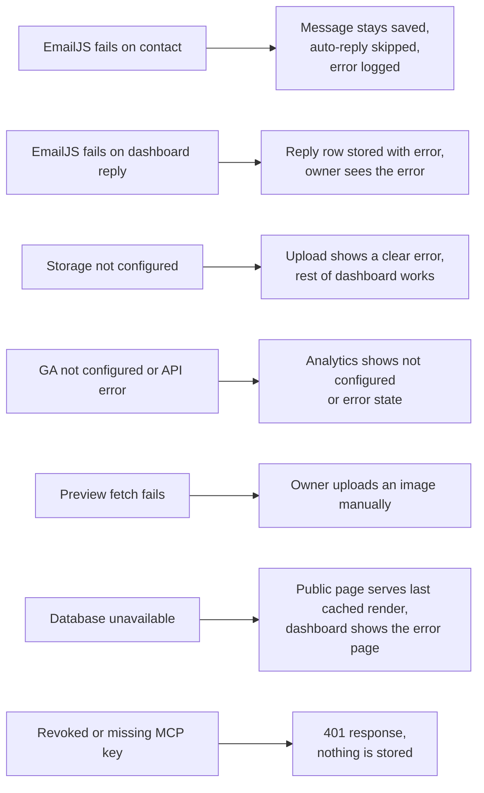
```mermaid
flowchart LR
    F1["EmailJS fails on contact"] --> R1["Message stays saved,<br/>auto-reply skipped,<br/>error logged"]
    F2["EmailJS fails on dashboard reply"] --> R2["Reply row stored with error,<br/>owner sees the error"]
    F3["Storage not configured"] --> R3["Upload shows a clear error,<br/>rest of dashboard works"]
    F4["GA not configured or API error"] --> R4["Analytics shows not configured<br/>or error state"]
    F5["Preview fetch fails"] --> R5["Owner uploads an image manually"]
    F6["Database unavailable"] --> R6["Public page serves last cached render,<br/>dashboard shows the error page"]
    F7["Revoked or missing MCP key"] --> R7["401 response,<br/>nothing is stored"]
```
